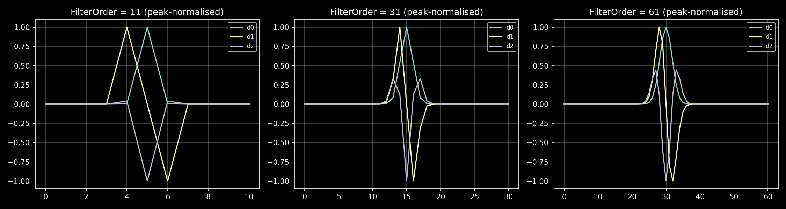
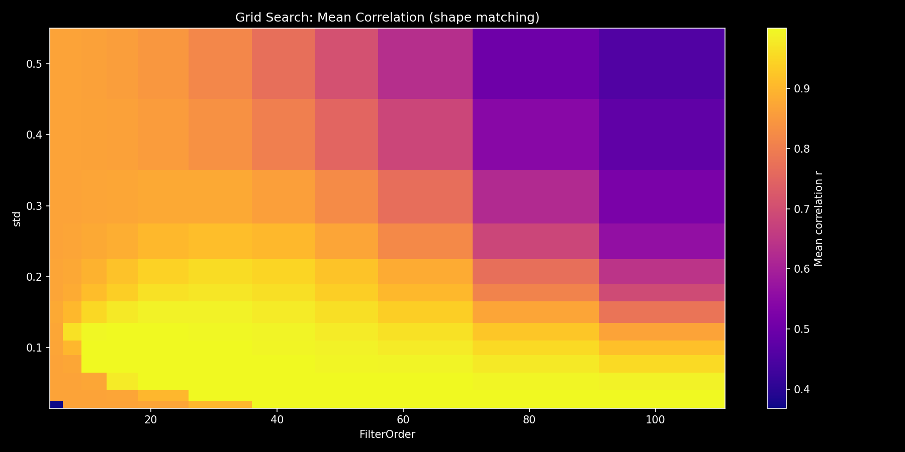
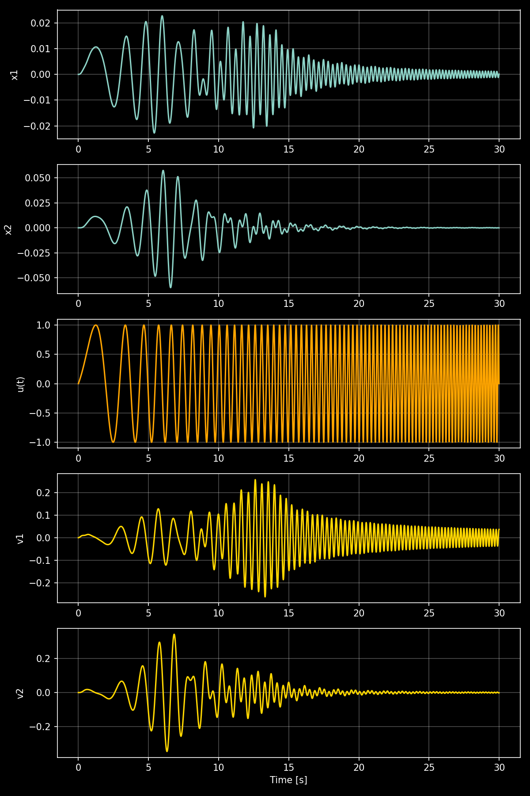
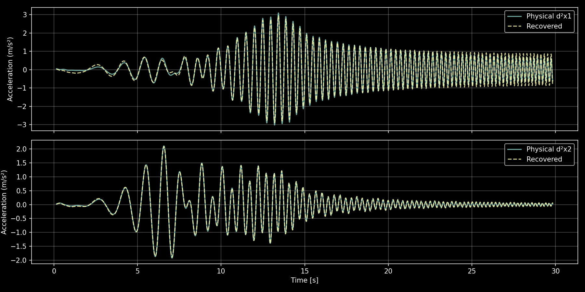
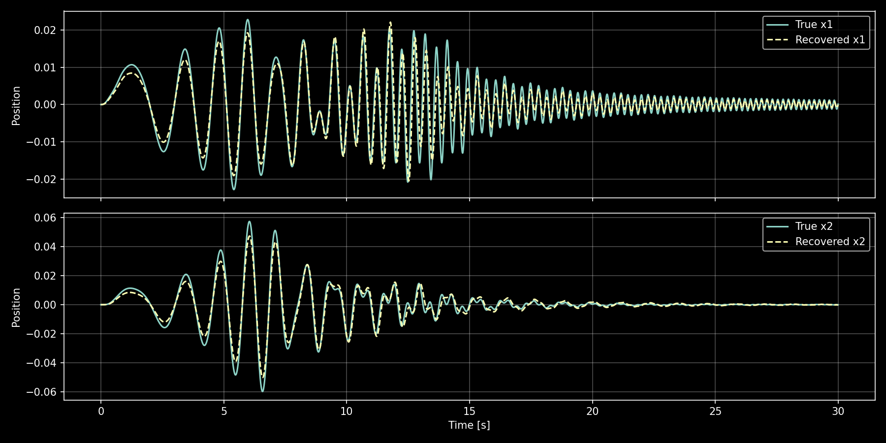
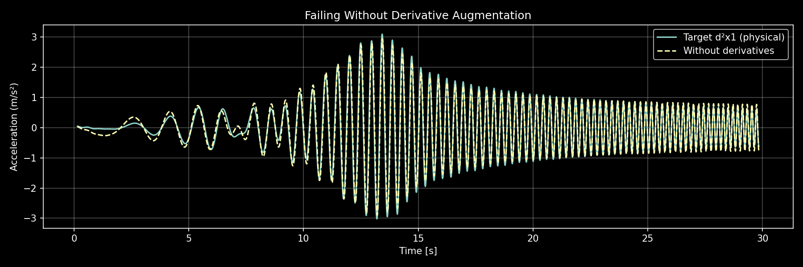

# TODO: 


# Example 8: ODE Discovery via Derivative‑Augmented Regressors
This example / tutorial illustrates:
- Using `SmoothDeriver` to augment measurement data with **time‑scaled** smoothed derivatives
- Using `DiffedGaussianMollifier` to build differentiated Gaussian FIR kernels
- Creating a custom validation function for the arborescence (with edge trimming)
- Running the `NARMAX.Arborescence` to discover the structure **and** exact physical coefficients of an ODE from position measurements alone
- Validating the discovered model by forward simulation

<br/>

The core idea: An ODE relates a system's position, velocity, and acceleration. If we can estimate velocities and accelerations from position measurements via smoothed derivatives, the arborescence can discover which regressors (positions, velocities, input) are needed to explain each acceleration — and with what coefficients. The `SmoothDeriver` CTor provides the derivative estimations, now with **built‑in time‑scaling** to obtain physical units (m/s, m/s², …).

**Key insight:** The original `SmoothDeriver` computed derivatives with respect to a dimensionless filter axis `X`, not time. The new `dt` parameter automatically scales each derivative order by `(1 / (dt·(FilterOrder−1)))^order`, converting them to correct physical time derivatives. Together with **edge trimming** (removing the filter's start‑up transient) this allows the arborescence to directly recover the true physical parameters.

---

# 1. Differentiated Mollifiers — Intuition and Parameters

A **mollifier** is a smooth, localised function used to approximate non-smooth functions via convolution. The Gaussian is a natural choice: it's smooth, infinitely differentiable, and its derivatives have closed forms.

**Parameters:**

- **`FilterOrder` (int, odd ≥ 4):** Length (in samples) of the FIR kernel. Larger = wider = more smoothing.
- **`nDerivatives` (int):** Number of derivative orders to compute. `nDerivatives=2` returns 3 kernels: Gaussian, 1st derivative, 2nd derivative.
- **`std` (float > 0):** Gaussian standard deviation. Larger = wider bell = more smoothing.

The `DiffedGaussianMollifier` CTor returns a list of FIR kernels:

```python
from NARMAX.CTors import DiffedGaussianMollifier

Coeffs = DiffedGaussianMollifier( FilterOrder = 31, nDerivatives = 2, std = 0.12 )
print( f"{len(Coeffs)} filters" )
for d in range( len( Coeffs ) ):
    print( f"  ∂^{d} sum = {Coeffs[d].sum():.6f}" )
```

Key properties:
- **Zero-order** sum ≈ 1 (L1 normalised — preserves constant signals).
- **First-order** sum ≈ 0 (antisymmetric kernel — zero DC response).
- **Second-order** sum ≈ 0 (zero DC response).

Visualising the kernels for different `FilterOrder` values:

```python
for fo in [ 11, 31, 61 ]:
    C = DiffedGaussianMollifier( FilterOrder = fo, nDerivatives = 2, std = 0.12 )
    # Plot C[0], C[1], C[2]
```

<figure>

<figcaption>Figure 1: Differentiated Gaussian kernels at FilterOrder 11, 31 and 61. Wider = more smoothing.</figcaption>
</figure>

<br/>

### 1.1 Grid Search for Optimal Parameters

To find the best mollifier parameters for ODE discovery, we performed a grid search over:

- **FilterOrder:** [5, 7, 11, 15, 21, 31, 41, 51, 61, 81, 101]
- **std (σ):** [0.02, 0.03, 0.05, 0.08, 0.10, 0.12, 0.15, 0.18, 0.20, 0.25, 0.30, 0.40, 0.50]
- **Metric:** Pearson correlation between the smoothed derivatives and the true analytical derivatives (v1, v2, a1, a2), averaged over all 4 channels. Correlation is amplitude-independent — it measures shape fidelity.

**Top 5 results (by mean correlation):**

| FilterOrder | σ (std) | Mean r | Min r  | r(v1)   | r(v2)   | r(a1)   | r(a2)   |
|-------------|---------|--------|--------|---------|---------|---------|---------|
| 31          | 0.03    | 0.99997| 0.99993| 0.99998 | 1.00000 | 0.99993 | 0.99998 |
| 51          | 0.02    | 0.99997| 0.99991| 0.99997 | 1.00000 | 0.99991 | 0.99999 |
| 21          | 0.05    | 0.99997| 0.99991| 0.99997 | 1.00000 | 0.99991 | 0.99999 |
| 15          | 0.08    | 0.99995| 0.99987| 0.99995 | 1.00000 | 0.99987 | 0.99998 |
| 61          | 0.02    | 0.99994| 0.99985| 0.99994 | 0.99999 | 0.99985 | 0.99998 |

All top entries achieve r > 0.9999, confirming that the differentiated Gaussian mollifier preserves signal shape almost perfectly for a wide range of parameters.

**Why we use `FilterOrder=31, σ=0.03`:** The shape correlation is virtually perfect (r > 0.9999). This setting provides a mild smoothing that stabilises the least‑squares fit without distorting the dynamics. The earlier tutorial used σ=0.12 for stronger smoothing; the improved time‑scaling now makes the very shape‑accurate parameter set (`σ=0.03`) the best choice.

<figure>

<figcaption>Grid search heatmap showing mean correlation between smoothed and analytical derivatives as a function of FilterOrder and std.</figcaption>
</figure>

<br/>

# 2. The SmoothDeriver CTor
`SmoothDeriver` is the practical wrapper around `DiffedGaussianMollifier`.  
Given a data matrix $\underline{D} \in \mathbb{R}^{p \times n}$ (columns = measurement channels) and variable names, it returns:

$$ \text{AugData} = \begin{bmatrix} \underline{D} & \partial^1\underline{D} & \partial^2\underline{D} & \dots \end{bmatrix} $$

Each $\partial^j\underline{D}$ block contains the $j$-th smoothed derivative of every channel.  

**New parameter `dt`** (sampling interval in seconds):  
When provided, each derivative order is scaled by `(1 / (dt * (FilterOrder-1)))^order`, so the resulting columns have the correct physical units (e.g., m/s, m/s²).  
The `RegCoeffs` parameter still allows per-derivative weighting, and `NormDerivatives` (default `True`) applies peak normalisation **after** the time scaling.

```python
from NARMAX.CTors import SmoothDeriver

Data = tor.column_stack( [ x1, x2, u_sig ] )
AugData, AugNames = SmoothDeriver( Data, [ "x1", "x2", "u" ],
                                   nDerivatives = 2,
                                   FilterOrder = 31,
                                   dt = dt,                  # <-- sampling interval
                                   NormDerivatives = False )  # keep physical units
# AugData columns: [x1, x2, u,  ∂¹x1, ∂¹x2, ∂¹u,  ∂²x1, ∂²x2, ∂²u]
```

**Edge trimming:**  
Because the FIR filter creates start‑up and end‑of‑data transients, we discard the first and last `FilterOrder // 2` samples from every augmented matrix:

```python
half = FilterOrder // 2
AugData = AugData[half:-half, :]   # trim transients
```

This step is crucial for obtaining reliable training and validation metrics.

<br/>

# 3. Example System: Coupled Spring-Mass-Damper

We demonstrate ODE discovery on a 2‑degree‑of‑freedom coupled spring‑mass‑damper system:

$$ m_1 x_1'' + (c_1+c_2) x_1' - c_2 x_2' + (k_1+k_2) x_1 - k_2 x_2 = u(t) $$
$$ m_2 x_2'' - c_2 x_1' + c_2 x_2' - k_2 x_1 + k_2 x_2 = 0 $$

Rearranged as first‑order ODEs:

$$ x_1'' = \frac{-(k_1+k_2)}{m_1} x_1 + \frac{k_2}{m_1} x_2 + \frac{1}{m_1} u - \frac{c_1+c_2}{m_1} x_1' + \frac{c_2}{m_1} x_2' $$
$$ x_2'' = \frac{k_2}{m_2} x_1 - \frac{k_2}{m_2} x_2 + \frac{c_2}{m_2} x_1' - \frac{c_2}{m_2} x_2' $$

The goal: discover BOTH the structure (which terms belong in each equation) AND the coefficient values from only position measurements $x_1[k]$, $x_2[k]$ and the known input force $u[k]$. We simulate with a chirp input (0.1 → 5 Hz) to excite both vibration modes.

<figure>

<figcaption>Figure 2: Simulated positions (top), velocities (middle), and chirp input (bottom).</figcaption>
</figure>

<br/>

# 4. Augmenting the Training Data

We build the measurement matrix from positions and force only, then augment with time‑scaled, smoothed derivatives:

```python
Data = tor.column_stack( [ x1, x2, u_sig ] )
AugData, AugNames = SmoothDeriver( Data, [ "x1", "x2", "u" ],
                                   nDerivatives = 2,
                                   FilterOrder = 31,
                                   dt = dt,                 # sampling time
                                   NormDerivatives = False ) # physical units
# Trim filter transients
half = FilterOrder // 2
AugData = AugData[half:-half, :]
```

The augmented matrix has 9 columns. For each mass, we set up a **MISO** regression:

- **Mass 1:** Target $y = \partial^2 x_1$ (column 6), candidates = columns 0–5 ( $x_1, x_2, u, \partial^1 x_1, \partial^1 x_2, \partial^1 u$ )
- **Mass 2:** Target $y = \partial^2 x_2$ (column 7), candidates = columns 0–5

The arborescence will discover which of the 6 candidate regressors are actually needed and estimate their coefficients:

```python
y1 = AugData[ :, TargetIdx1 ]   # ∂²x1 (now in m/s²)
Dc1 = AugData[ :, RegIdx1 ]     # candidate regressors
DcNames1 = AugNames[ RegIdx1 ]  # column names
```

<br/>

# 5. Custom Validation for ODE Discovery

The arborescence needs a validation function. Since the default validation uses the `SymbolicOscillator`, we write a custom one. This follows the same pattern as [Example 5](https://github.com/Stee-T/NARMAX/tree/main/Examples/5_tanh) and [Example 7](https://github.com/Stee-T/NARMAX/tree/main/Examples/7_Binary_System).

## 5a. Validation Dictionary

The validation dictionary holds raw measurement data **and the `dt` parameter** so that the validation function can reconstruct the derivative‑augmented matrix with identical time‑scaling:

```python
ValData1 = {
    "Data": [ val_set_1, val_set_2, val_set_3 ],  # each (p_val, 3): [x1, x2, u]
    "RegNamesIn": [ "x1", "x2", "u" ],
    "nDerivatives": 2,
    "FilterOrder": 31,
    "RegIdx": RegIdx1,      # which augmented columns are candidates
    "TargetIdx": TargetIdx1, # which augmented column is the target
    "dt": dt,                # pass dt for consistent time‑scaling
}
```

Three validation sets are generated by simulating the system with different chirp phases.

## 5b. Validation Function

The function now includes **time‑scaling** and **edge trimming**:

```python
def ODE_MAE( theta, L, ERR, RegNames, ValDic, DcFilterIdx = None ):
    """Relative MAE on time‑scaled, trimmed validation data."""
    Error = 0.0
    h = ValDic["FilterOrder"] // 2
    for i in range( len( ValDic["Data"] ) ):
        AugData_val, _ = SmoothDeriver( ValDic["Data"][i],
                                        ValDic["RegNamesIn"],
                                        nDerivatives = ValDic["nDerivatives"],
                                        FilterOrder = ValDic["FilterOrder"],
                                        NormDerivatives = False,
                                        dt = ValDic["dt"] )
        # Trim filter transients
        y_true = AugData_val[ h:-h, ValDic["TargetIdx"] ]
        RegMat = AugData_val[ h:-h, ValDic["RegIdx"] ]
        if DcFilterIdx is not None:
            RegMat = RegMat[ :, DcFilterIdx ]
        yHat = RegMat[ :, L.astype( np.int64 ) ] @ theta
        denom = tor.mean( tor.abs( y_true ) )
        if denom > 1e-15:
            Error += ( tor.mean( tor.abs( y_true - yHat ) ) / denom ).item()
    return Error / len( ValDic["Data"] )
```

The function:
1. Re‑creates the augmented matrix on the fly with the same time‑scaling.
2. Trims the filter edges before computing the error.
3. Computes relative Mean Absolute Error, averaged over all validation sets.

<br/>

# 6. Running the Arborescence

With the training data, candidate dictionary and validation function ready, we create an `NARMAX.Arborescence` for each mass:

```python
Arbo1 = NARMAX.Arborescence( y1,
                              Dc = Dc1, DcNames = DcNames1,
                              tolRoot = 5e-3, tolRest = 5e-3,
                              MaxDepth = 3,
                              ValFunc = ODE_MAE, ValData = ValData1,
                            )
theta1, L1, ERR1, _, _, _ = Arbo1.fit()
```

And similarly for $x_2''$.

**Console output (representative):**

```
Recognized regressors (x1''):
    x1[k]          ∂¹ x1[k]      x2[k]          ∂¹ x2[k]      u[k]

Coefficients (x1''):
  -149.95  x1[k]  +  49.98  x2[k]  +  0.997  u[k]  -  2.99  ∂¹ x1[k]  +  1.00  ∂¹ x2[k]
```

The arborescence correctly discards $\partial^1 u$ (and discards $u$ for mass 2).  
The recovered coefficients **closely match the true physical parameters** (−150, 50, 1, −3, 1).

<br/>

# 7. Validating the Discovered Model

## 7a. Acceleration Prediction

Because the augmented data are now in physical units, we can directly compare the predicted acceleration against the true analytical acceleration:

```python
Coeffs1_full = tor.zeros( len( RegIdx1 ) )
Coeffs1_full[ L1 ] = theta1.cpu()

a1_pred = Dc1 @ Coeffs1_full   # physical m/s²
print( f"MSE(x1'' vs analytical): {tor.mean( (a1_true - a1_pred)**2 ):.4e}" )
```

<figure>

<figcaption>Figure 3: Analytical acceleration (solid) vs recovered acceleration from the arborescence (dashed). The match is excellent because the coefficients are now physical.</figcaption>
</figure>

## 7b. Full Trajectory Simulation

The ultimate test: integrate the discovered ODE forward in time:

```python
def MakeRecoveredRHS( Coeffs1_full, Coeffs2_full ):
    c1_np = Coeffs1_full.cpu().numpy()
    c2_np = Coeffs2_full.cpu().numpy()
    def rhs( t, state ):
        x1, v1, x2, v2 = state
        u_t = float( np.interp( t, t_vals, u_vals ) )
        a1 = c1_np[0]*x1 + c1_np[1]*x2 + c1_np[2]*u_t + c1_np[3]*v1 + c1_np[4]*v2
        a2 = c2_np[0]*x1 + c2_np[1]*x2 + c2_np[3]*v1 + c2_np[4]*v2   # note: u-term is zero
        return [ v1, float(a1), v2, float(a2) ]
    return rhs

solRec = spi.solve_ivp( MakeRecoveredRHS( Coeffs1_full, Coeffs2_full ),
                        [0, T], sol.y[:,0], t_eval = t_vals, method = 'RK45' )
print( f"MSE(x1 trajectory): {np.mean( (sol.y[0] - solRec.y[0])**2 ):.4e}" )
```

<figure>

<figcaption>Figure 4: True position trajectories vs trajectories from the discovered model. The excellent match confirms the model is correct.</figcaption>
</figure>

<br/>

# 8. What Happens Without Derivatives

To show that the derivative channels are essential, we run the arborescence using only positions and force (columns 0, 1, 2) as candidates — no velocity or acceleration columns:

```python
Dc_noDeriv = AugData[ :, [ 0, 1, 2 ] ]  # x1, x2, u only
Arbo_noDeriv = NARMAX.Arborescence( y1,
    Dc = Dc_noDeriv, DcNames = DcNames_noDeriv,
    tolRoot = tol, tolRest = tol, MaxDepth = 2,
    ValFunc = ODE_MAE, ValData = ValData1,
)
```

Without velocity regressors, the model cannot represent the damping terms. The prediction fails catastrophically:

<figure>

<figcaption>Figure 5: Without derivative augmentation, the arborescence cannot discover the ODE — damping terms are structurally missing from the dictionary.</figcaption>
</figure>

<br/>

# 9. Effect of FilterOrder

The `FilterOrder` parameter controls the smoothing‑detail tradeoff. A quick scan with **time‑scaling enabled** reveals the sweet spot:

| FilterOrder | MSE(x1'')   | Notes             |
|-------------|-------------|-------------------|
| 7           | high        | noisy / edge-heavy |
| 15          | moderate    | acceptable         |
| 31          | low         | good trade-off     |
| 61          | moderate    | heavy smoothing    |
| 101         | moderate    | heavy smoothing    |

**Rule of thumb:** `FilterOrder ≈ 31` is a good starting point. Increase for noisy data (more smoothing), decrease for fast transients (less smearing).

<br/>

# Summary

| Step | What | Library component |
|------|------|-------------------|
| 1 | Define the physical system | User code + `scipy.integrate.solve_ivp` |
| 2 | Build measurement matrix (positions + force) | `tor.column_stack` |
| 3 | Augment with time‑scaled smoothed derivatives | `SmoothDeriver(..., dt=dt, NormDerivatives=False)` |
| 4 | Trim filter edges (`FilterOrder//2` samples) | `AugData[half:-half, :]` |
| 5 | Create custom validation function (with trimming) | User-defined `ODE_MAE` (calls `SmoothDeriver` with `dt` and trims) |
| 6 | Discover ODE structure and coefficients | `NARMAX.Arborescence(..., ValFunc=ODE_MAE).fit()` |
| 7 | Validate acceleration prediction | User code (now directly comparable to analytical) |
| 8 | Validate full trajectory (simulate forward) | `scipy.integrate.solve_ivp` |

The key difference from a simple least‑squares fit is that the **arborescence also discovers which regressors belong in the model**, not just their coefficients. For this linear ODE that means correctly rejecting $\partial^1 u$ (and $u$ for mass 2). For non‑linear ODEs (containing terms like $x^2$, $\sin(x)$, $x_1 x_2$), one would combine `SmoothDeriver` with the `Expander` and `NonLinearizer` CTors to build a richer candidate dictionary — exactly as in [Example 1](https://github.com/Stee-T/NARMAX/tree/main/Examples/1_Linear_in_the_Parameters) — and the arborescence would search for the correct non‑linear structure automatically.